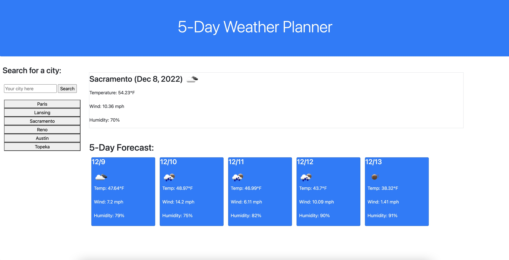

# Weather Dashboard

## Description

This webpage serves as a way of finding out the weather conditions in a specific city. The user will receive both current conditons and a display of the five day forecast. 

[Weather Dashboard](https://sam-lerner.github.io/weather-dashboard-sam-lerner/ "Go to the Website!")

## Mock-Up

The following is a screen shot of the page with results returned:

## Installation

N/A

## Usage

After accessing the website, enter your desired city and click the search button. Your cities will be saved for future access.

## Credits

Thank you to classmates Eric Kirberger, Peter Lim and Azime Nail, tutor Dru Sanchez, TAs Paul Cwik and Manoli Koutouzos for their guidance with this project. 

## License

N/A

## Badges

